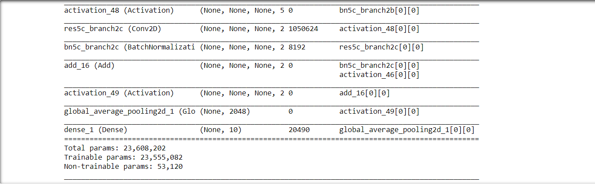
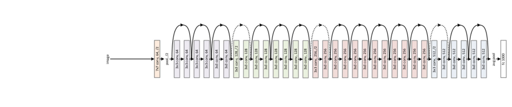

# Object-Classificarion-Resnet50
Object Classification using Resnet50 Network on cifar10 datasets from keras.  
The Network Used is Resnet50 as the base model.  
The images were imported from keras.datsets containing about 50000 training imaages with 10000 testing images.  
The model was created with Resnet50 as its base model and a GlobalAveragePooling2D layer and a Dense layer with softmax activation.  
The optimzer was Adam, 100 epochs with batch size of 32 and early stopping with patience of 10 and lr_reduce with factor of 0.1 and     patience of 2 were applied to the network.  
The training set was split into validation set and tgraining set itself with a validation split = 0.1  
# The code explanation.
The first Cell Includes all the import for the creation of the model.  
It also includes the import of the cifar10 datsets from keras.datsets.  
In the next cell I load the data into training and testing sets for the model creation and training.  
"def resnet_model():  
    base_model = ResNet50(weights = None, include_top = False)  
    x = base_model.output  
    x = GlobalAveragePooling2D()(x)  
    pred = Dense(10, activation = "sigmoid")(x)  
    model_resnet = Model(input=base_model.input, output = pred)  
    return model_resnet"  
 This is the model that we trained on the cifar datasets. 
 As one can see the base model is the predefined renet50 model pretrained with imagenet dataset.
 
# The model Summary
"model_resnet=resnet_model()  
model_resnet.compile(loss='binary_crossentropy', optimizer=Adam(), metrics=['accuracy'])  
model_resnet.summary()"  
This gives us the model summary containing 23,608,202 parameters with 23,555,082 as trainable parameters and rest as non trainable parameters.  

# The Model Image

# Training Model
"resnet_val_hist = model_resnet.fit(X_train, y_train, epochs = nepoch, batch_size=batch_size, callbacks = [lr_reduce, checkpoint, earlyStopping], validation_split = 0.1, verbose = 2)"  
The batch size is 32  and the epochs are 100 with early stopping of  patience 10.  
# Results
The Training accuracy was 95.16.  
The testing acuuracy was 93.28  
